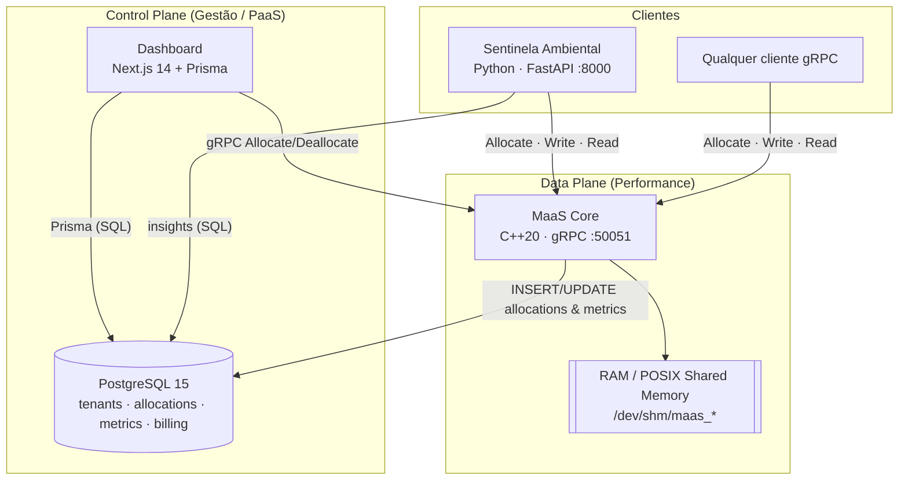
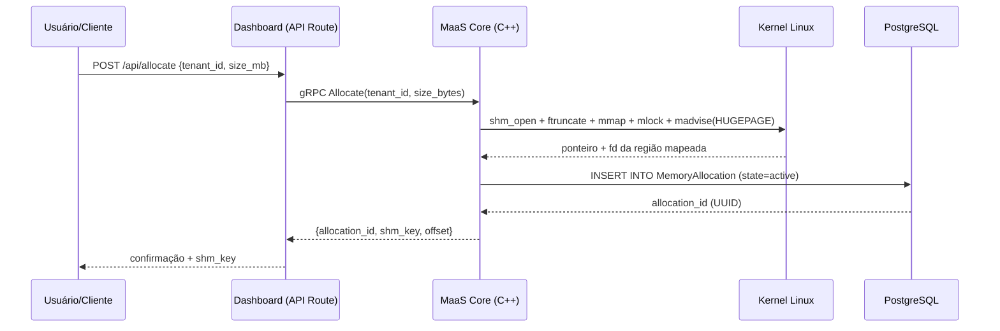

# MaaS — Memory as a Service 🚀


**MaaS (Memory as a Service)** é uma infraestrutura de **Software-Defined Memory (SDM)** construída como uma plataforma de serviços (PaaS). O projeto desacopla a memória volátil (RAM) da aplicação que a consome: um **núcleo em C++** expõe pools de RAM física via **gRPC**, permitindo que clientes remotos aloquem, leiam e escrevam memória compartilhada pela rede com latência próxima à do barramento local.

> Em uma frase: o cliente "aluga" RAM de um servidor e a usa como se fosse memória local, transferindo o trabalho pesado de processamento para a camada de memória gerenciada — o conceito de **Memory Disaggregation**.

---

## 📌 Contexto Acadêmico (PI-III)

Projeto da Unidade Curricular **Projeto Integrador Computação III** (5º Período) do curso de **Tecnologia em Análise e Desenvolvimento de Sistemas (TADS)** da **FAESA Centro Universitário**.

- **Orientador:** Prof. Me. Howard Cruz Roatti
- **Desenvolvimento:** Dyone Nunes de Andrade — *Full Stack, Engenharia de Dados e Infraestrutura*

### Tema e impacto social
O ecossistema é exercitado por um caso de uso na área de **Meio Ambiente**: o módulo **Sentinela Ambiental** ingere e processa dados térmicos de satélites (NASA FIRMS) em alta velocidade usando a RAM alugada do MaaS, gerando alertas geolocalizados de focos de calor úteis à **Defesa Civil**, **Corpo de Bombeiros** e **Secretarias de Meio Ambiente**.

### Video no youtube
- **Link:** https://youtu.be/x8Hn4Qob_7I

- 


---

## 🧭 Visão Geral da Arquitetura

O ecossistema é dividido em dois planos, no melhor estilo de infraestruturas de nuvem:

- **Data Plane (motor de performance):** o `MaaS Core` em C++, que realmente toca o hardware (mmap, shared memory, mlock, huge pages).
- **Control Plane (gestão / PaaS):** o `Dashboard` Next.js + o banco PostgreSQL, que registram tenants, alocações, métricas e faturamento, oferecendo observabilidade.



### Fluxo de uma alocação (Allocate)



---

## 🧩 Componentes

| Componente | Pasta | Stack | Porta | Papel |
| :--- | :--- | :--- | :--- | :--- |
| **MaaS Core** | [`server/`](server/) | C++20, gRPC, libpq | `50051` | Aloca/gerencia RAM via `mmap`/shared memory; expõe RPCs |
| **Dashboard** | [`dashboard/`](dashboard/) | Next.js 14, Prisma 7, Tailwind | `3002` | Painel PaaS: tenants, alocações, métricas, relatórios |
| **Banco de Dados** | [`db/`](db/) | PostgreSQL 15 | `5433` | Persistência de tenants, alocações, métricas e billing |
| **Contrato gRPC** | [`proto/`](proto/) | Protocol Buffers | — | Definição do serviço `MemoryService` (fonte da verdade) |
| **Sentinela Ambiental** | [`Consumidor/`](Consumidor/) | Python 3.11, FastAPI | `8000` | Cliente de demonstração: ingestão e IA sobre dados térmicos |

### 1. MaaS Core (C++) — Data Plane

Servidor **gRPC síncrono** (`server/main.cpp`) que gerencia memória física:

- **Alocação:** cada `Allocate` cria um objeto **POSIX shared memory** independente (`shm_open` em `/dev/shm/maas_<uuid>`), dimensionado com `ftruncate` e mapeado com `mmap(MAP_SHARED)`.
- **Garantias de performance:** `mlock` trava as páginas em RAM (sem swap) e `madvise(MADV_HUGEPAGE)` solicita *Transparent Huge Pages* para blocos ≥ 2 MiB.
- **Controle de capacidade:** um contador atômico (`std::atomic`) impõe o limite lógico da arena (`MAAS_ARENA_SIZE`, padrão **1 GiB**), com fast-path *lock-free* via `compare_exchange`.
- **Concorrência:** `ShmManager` usa `std::shared_mutex` (múltiplos leitores) sobre o mapa de blocos; `DatabaseClient` serializa o acesso ao libpq via `std::mutex`.
- **Persistência:** grava metadados de alocação e métricas no PostgreSQL via **libpq**. O `node_id` é fixo no MVP (`00000000-0000-0000-0000-000000000001`, semeado no schema).
- **Limites gRPC:** mensagens de até **64 MiB** (permite I/O de blocos grandes em uma chamada).

> ℹ️ `cgroups` e deduplicação *copy-on-write* aparecem como campos/planejamento no schema, mas **não** estão implementados no núcleo neste estágio. A deduplicação de dados acontece na camada do cliente (Sentinela), por arredondamento de coordenadas.

### 2. Dashboard (Next.js) — Control Plane

Aplicação **Next.js 14 (App Router, Server Components)** em `dashboard/`:

- **Páginas:** home (`/`) com KPIs em tempo real (RAM ativa, tenants ativos, saúde do banco), gráfico *Top Tenants* (Recharts) e tabela das últimas alocações; e `/tenants` para gestão de clientes.
- **API Routes:** `POST/GET /api/tenants`, `POST /api/allocate` (chama o Core via gRPC), `GET /api/report` (agrega consumo por período).
- **Dados:** **Prisma 7** com adapter `@prisma/adapter-pg`, client gerado em `src/generated/prisma`.
- **gRPC:** `src/lib/gRPC_Client` carrega o `.proto` dinamicamente e chama o Core em `MAAS_CORE_HOST` (padrão `maas-core:50051`).
- **Funcionalidades:**
  - Criar **tenant** (gera `api_key` `maas_live_...`).
  - **Alocar memória** (slider 1–512 MB → gRPC `Allocate` → confirma persistência).
  - **Relatório de consumo mensal**: modal com período, gráfico de evolução mês a mês, tabela por tenant e **exportação em CSV e PDF** (`jspdf` + `jspdf-autotable`).

### 3. Banco de Dados (PostgreSQL)

Schema em [`db/schema.sql`](db/schema.sql), inicializado automaticamente pelo container. Tabelas principais:

| Tabela | Função |
| :--- | :--- |
| `Tenant` | Clientes do PaaS (nome, plano, `api_key`, status) |
| `TenantQuota` | Limites de recursos por tenant e período |
| `ClusterNode` | Nós físicos que provêem RAM (capacidade, heartbeat) |
| `MemoryAllocation` | **Coração do sistema** — registro de cada `mmap` (shm_key, offset, tamanho, estado) |
| `ObservabilityMetrics` | Telemetria (RTT, cache hit, pressão de memória) |
| `AtomicBilling` | Faturamento granular por consumo (byte·segundo, micros) |

Enums de domínio: `tenant_status`, `node_status`, `allocation_state`.

### 4. Sentinela Ambiental (Consumidor) — cliente de demonstração

Ecossistema Python em [`Consumidor/`](Consumidor/) que consome o MaaS para processar anomalias térmicas. **Stateless por design**: o peso dos dados vive na RAM alugada do Core.

- **Pipeline de 3 estágios**, comunicando-se por **buffers de memória compartilhada** com layout binário fixo (validado por testes):
  1. **Ingestor** → busca dados da **NASA FIRMS** (VIIRS/MODIS) e escreve registros brutos (`struct '=ddddiii'`, 44 bytes).
  2. **Data Processor** → filtra/deduplica, calcula *features* (densidade de vizinhos, hora, mês) e grava no PostgreSQL + buffer de features (36 bytes).
  3. **AI Processor** → inferência com **LightGBM** (com *fallback* heurístico) e gera predições/urgência (24 bytes).
- **API + UI:** **FastAPI** (`uvicorn`, porta `8000`) servindo endpoints REST (`/api/alerts`, `/api/stats`, `/api/predictions`) e uma interface 3D (**Three.js + Globe.gl**) em `static/index.html`. Integra ainda o **Google Earth Engine** (MODIS LST / Landsat) para camadas térmicas.
- **Banco próprio:** schema `sentinela_ambiental` (separado do schema do MaaS).

> O Consumidor possui seu **próprio** `docker-compose.yml` e ciclo de vida, mas está documentado no MkDocs deste repositório (seção *Sentinela Ambiental*) junto com o MaaS.

---

## 📡 Contrato gRPC (`MemoryService`)

Definido em [`proto/maas.proto`](proto/maas.proto):

| RPC | Tipo | Descrição |
| :--- | :--- | :--- |
| `Allocate(AllocateRequest)` | unário | Aloca um bloco; retorna `allocation_id`, `shm_key`, `offset` |
| `Deallocate(DeallocateRequest)` | unário | Libera um bloco (munmap + `shm_unlink` + update no banco) |
| `WriteMemory(WriteRequest)` | unário | Escreve bytes em um offset da alocação (I/O remoto) |
| `ReadMemory(ReadRequest)` | unário | Lê bytes de um offset da alocação |
| `ReportMetrics(stream MetricsReport)` | *client-streaming* | Envia telemetria contínua; recebe um ACK final |
| `CheckHealth(Empty)` | unário | Healthcheck do servidor |

Coleções de teste prontas: [`postman_maas_grpc.json`](postman_maas_grpc.json) e [`insomnia_maas_grpc.json`](insomnia_maas_grpc.json).

---

## 📂 Estrutura do Repositório

```text
Projeto-Integrador-III/
├── server/             # MaaS Core — servidor C++ gRPC (main.cpp, CMakeLists.txt)
├── dashboard/          # Painel PaaS — Next.js 14 + Prisma
├── db/                 # schema.sql (PostgreSQL) — inicialização do banco
├── proto/              # maas.proto — contrato gRPC (fonte da verdade)
├── docs/               # Documentação MkDocs do MaaS (este repositório)
├── scripts/            # Clientes/teste em Python (maas_writer, maas_reader, etc.)
├── Consumidor/         # Sentinela Ambiental (cliente Python, compose próprio)
├── Dockerfile          # Build multi-stage do MaaS Core
├── docker-compose.yml  # Orquestra db + maas-core + dashboard
└── mkdocs.yml          # Configuração do site de documentação
```

---

## 🚀 Como Executar

### Pré-requisitos
- **Docker** e **Docker Compose**
- Kernel **Linux** (o Core depende de `shm_open`, `mmap`, `mlock`, `madvise`)

### Subir a stack do MaaS (Core + Dashboard + Banco)

```bash
# a partir da raiz do repositório
docker compose up -d --build
```

Isso sobe três serviços:

| Serviço | Acesso | Observação |
| :--- | :--- | :--- |
| **Dashboard** | http://localhost:3002 | Painel PaaS (Next.js) |
| **MaaS Core** | `localhost:50051` (gRPC) | Servidor C++ |
| **PostgreSQL** | `localhost:5433` | Banco do MaaS (schema auto-inicializado) |

O Core recebe as *capabilities* `SYS_ADMIN` e `IPC_LOCK` (necessárias para huge pages e `mlock`) e `ipc: host` via `docker-compose.yml`.

### Subir o Sentinela Ambiental (opcional, cliente de demonstração)

```bash
cd Consumidor
cp .env.example .env   # preencha NASA_MAP_KEY, conexões e credenciais GEE
docker compose up -d --build
```

| Serviço | Acesso |
| :--- | :--- |
| **Sentinela Dashboard (3D)** | http://localhost:8000 |
| **PostgreSQL (insights)** | `localhost:5436` |

> Ambas as stacks usam a rede Docker `maas-network`. Se subir o Consumidor separadamente, garanta que a rede exista (a stack do MaaS a cria; ou declare-a como `external`).

---

## 🔧 Variáveis de Ambiente Principais

### MaaS Core (`server/`)
| Variável | Padrão | Descrição |
| :--- | :--- | :--- |
| `MAAS_GRPC_ADDR` | `0.0.0.0:50051` | Endereço de escuta do servidor gRPC |
| `MAAS_PG_CONNINFO` | `host=db port=5432 ...` | String de conexão libpq (PostgreSQL) |
| `MAAS_ARENA_SIZE` | `1073741824` (1 GiB) | Limite lógico total de memória alocável |

### Dashboard (`dashboard/`)
| Variável | Padrão | Descrição |
| :--- | :--- | :--- |
| `DATABASE_URL` | — | Conexão PostgreSQL (Prisma) |
| `MAAS_CORE_HOST` | `maas-core:50051` | Endpoint gRPC do Core |
| `PROTO_PATH` | `./proto/maas.proto` | Caminho do contrato gRPC |

---

## 📚 Documentação (MkDocs)

A documentação técnica completa vive em [`docs/`](docs/) e é publicada com **MkDocs Material**:

```bash
pip install mkdocs-material
mkdocs serve        # http://127.0.0.1:8000
mkdocs build        # gera o site estático em ./site
```

> O site cobre o **MaaS** (Core, Dashboard, Banco e contrato gRPC) e também o módulo **Sentinela Ambiental** (Consumidor).

---

## 🤝 Como Integrar um Cliente

Qualquer linguagem com suporte a gRPC pode consumir o MaaS. O fluxo é sempre o mesmo:

1. **Allocate** → receba uma `shm_key` (ex.: `/maas_7f6cfca9`).
2. **Attach** → mapeie a região localmente (ex.: `posix_ipc` + `mmap` no Python) **ou** use `WriteMemory`/`ReadMemory` para I/O remoto via rede.
3. **Deallocate** → sempre libere ao terminar para devolver a RAM ao sistema.

Exemplos práticos estão em [`scripts/`](scripts/) e nos guias do MkDocs (Manual do Usuário e do Desenvolvedor).

---

## 📄 Licença

Distribuído sob a licença **MIT**.
