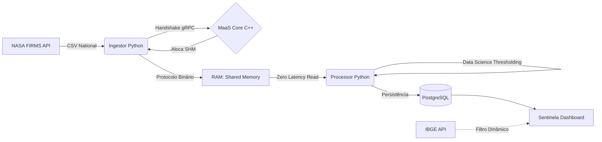

# MaaS: Memory as a Service (PaaS) 🚀


**MaaS (Memory as a Service)** é uma infraestrutura de **Software-Defined Memory (SDM)** desenvolvida como uma plataforma de serviços (PaaS). O projeto visa desatrelar a memória volátil (RAM) da CPU física, permitindo a alocação dinâmica de pools de memória via rede com latência ultra-baixa.

---

## 📌 Contexto Acadêmico (PI-III)
Este projeto é desenvolvido como parte integrante da Unidade Curricular **Projeto Integrador Computação III** (5º Período) do curso de Tecnologia em Análise e Desenvolvimento de Sistemas (**TADS**) na **FAESA Centro Universitário**.

**Orientador:** Prof. Me. Howard Cruz Roatti

### 🌍 Tema e Impacto Social
O projeto foca na área de **Meio Ambiente**, utilizando o ecossistema MaaS para ingestão e processamento de dados térmicos em altíssima velocidade (Sentinela Ambiental). 
**Sociedade Impactada:** Órgãos de Defesa Civil do Brasil, Corpo de Bombeiros, Secretarias de Meio Ambiente e a população brasileira afetada pelos impactos adversos de incêndios florestais e urbanos.

### 📊 Ciência de Dados e Métricas
Cumprindo os requisitos do edital, aplicamos modelagem analítica (*Data Mining*) via **Thresholding Contínuo** nos fluxos massivos de dados em memória. 
* **Métrica Principal (Desempenho/Impacto):** Volume de ruídos térmicos do clima descartados vs. Alertas Críticos confirmados (filtragem para Confiança >= 80% e Temp >= 330K).
* **Solução Web:** O projeto final conta com um painel (Streamlit) dotado de relatórios, KPIs geolocalizados e mapas indicativos de calor, idealizado para acelerar a tomada de decisão do poder público.

---

## 🛠️ Tecnologias e Arquitetura

O ecossistema MaaS é dividido em dois planos principais para garantir performance e escalabilidade:

### Data Plane (Motor de Performance)
* **Linguagem:** C++20 (Foco em gerenciamento manual de memória e ausência de Garbage Collector).
* **Alocação:** Utilização de `mmap`, `shm` e `cgroups v2` para isolamento de tenants no Kernel Linux.
* **Comunicação:** Protocolo gRPC sobre HTTP/2 com Protocol Buffers para serialização binária.
* **Tiering:** Algoritmo LRU customizado para swap inteligente entre RAM e NVMe.

### Control Plane (Gestão e PaaS)
* **Dashboard:** Next.js 15 (React) para interface administrativa e métricas.
* **Backend de Gestão:** API em Node.js integrada ao motor C++.
* **Persistência:** PostgreSQL (Dados relacionais) e Redis (Telemetria em tempo real).
* **Observabilidade:** Stack Prometheus & Grafana para monitoramento de latência e IOPS.

---

## 🛰️ Módulo Consumidor: Sentinela Ambiental

O módulo `Consumidor` é um ecossistema Python especializado em monitoramento ambiental nacional, atuando como o principal cliente da infraestrutura MaaS.

### 🏗️ Fluxo de Dados e Arquitetura


### 📄 Protocolo Binário (Low-Level)
Para garantir a performance PaaS, o Ingestor e o Processador comunicam-se via RAM utilizando uma estrutura binária compacta de **32 bytes** por registro:
| Campo | Tipo | Tamanho | Descrição |
| :--- | :--- | :--- | :--- |
| **Latitude** | Double | 8 bytes | Coordenada Y (WGS84) |
| **Longitude** | Double | 8 bytes | Coordenada X (WGS84) |
| **Temperatura** | Double | 8 bytes | Brilho térmico em Kelvin |
| **Confiança** | Integer | 4 bytes | Índice de precisão (0-100%) |
| **ID Record** | Integer | 4 bytes | Identificador único do satélite |

### ⚙️ Configuração (.env)
Principais variáveis para o módulo Consumidor:
| Variável | Exemplo | Descrição |
| :--- | :--- | :--- |
| `NASA_MAP_KEY` | `96284...` | Chave de API FIRMS (VIIRS/MODIS) |
| `DB_CONNECTION` | `postgresql://...` | Conexão com o banco local de insights |
| `MAAS_DB_URL` | `postgresql://...` | Banco de alocação do PaaS (MaaS Core) |
| `MAAS_BUFFER_SIZE`| `104857600` | Tamanho da RAM alocada (100MB) |

### 💡 Visão Arquitetural: Disaggregation & Stateless Client

O projeto demonstra o conceito de **Memory Disaggregation**, permitindo que o *Sentinela Ambiental* opere como uma aplicação **Stateless** (sem estado local). Todo o peso do processamento de Ciência de Dados e grandes volumes de informação é movido para a camada de memória gerenciada pelo MaaS, o que reflete a tendência das grandes infraestruturas modernas de nuvem.

**Cenário de Demonstração (Híbrido):**
- **Sede (Core):** MaaS Core operando em um ambiente *HomeLab* (Infra-estrutura privada).
- **Cliente (Edge/Cloud):** Sentinela Ambiental hospedado no *Google Cloud Platform (GCP)*.
- **Vantagem:** O cliente aluga memória remota para realizar o "trabalho sujo" de processamento massivo, otimizando ao máximo o consumo de RAM local no servidor da GCP e reduzindo custos operacionais.

---

## 👥 Equipe do Projeto (Core)

* **Dyone Nunes de Andrade** - *Desenvolvimento Full Stack, Engenharia de Dados e Infraestrutura* 
*(Demais membros/detalhes da formação do grupo enviados via canal oficial até 17/03).*

---

## 📂 Estrutura do Projeto (MVP C1)

```bash
├── maas-core/         # Motor de memória em C++
├── dashboard/         # Interface PaaS em Next.js
├── Consumidor/        # Ingestor Python e Sentinela Dashboard
├── proto/             # Contratos gRPC
└── db/                # Scripts de Inicialização Postgres
```

---

## ✨ Últimas Atualizações

* **Monitoramento Nacional (Brasil):** O sistema agora monitora o território brasileiro por completo, utilizando o endpoint de país (`BRA`) da API da NASA.
* **Integração IBGE API:** Implementada seleção dinâmica de estados via API oficial do IBGE, permitindo filtragem espacial instantânea no Dashboard.
* **Arquitetura de Buffer Circular (MaaS):** Otimização da sincronia entre Ingestor e Processador via memória RAM compartilhada (100MB / 3.2M de registros), garantindo latência zero e persistência resiliente no PostgreSQL.
* **Correções de Infraestrutura:** Resoluções nas redes do Docker e permissões para garantir a conexão sem falhas entre os conteineres gRPC e PostgreSQL.

---

## 🚀 Como Acessar (Frontend)

Após subir os containers com o Docker Compose (`docker compose up -d`), as interfaces podem ser acessadas localmente:

1. **Dashboard MaaS (Next.js):** [http://100.114.106.28:3002](http://100.114.106.28:3002)
   - Interface principal para observabilidade e visualização estatística do balanceamento de memória.
2. **Sentinela Dashboard (Streamlit):** [http://localhost:8501](http://localhost:8501)
   - Interface analítica focada nos dados consumidos de anomalias termais, com filtros geográficos e KPIs.
