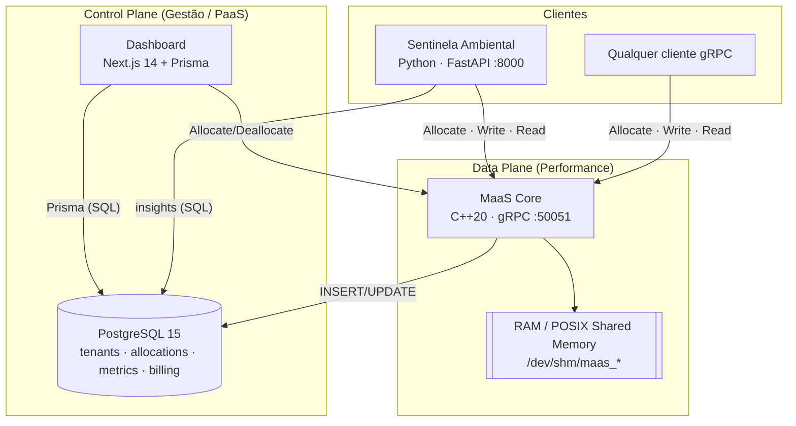
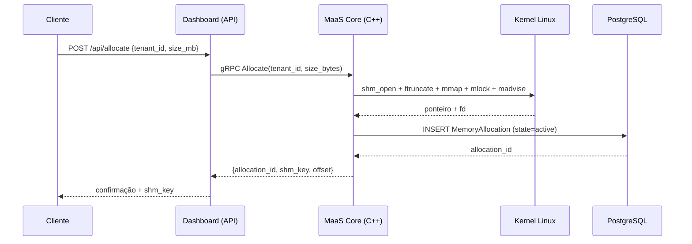

# Arquitetura

O ecossistema é dividido em dois planos, inspirado em infraestruturas de nuvem modernas.

- **Data Plane (motor de performance):** o **MaaS Core** em C++, que toca o hardware (`mmap`, shared memory, `mlock`, huge pages).
- **Control Plane (gestão / PaaS):** o **Dashboard** Next.js + o **PostgreSQL**, que registram tenants, alocações, métricas e faturamento e oferecem observabilidade.

## Princípio: Memory Disaggregation

O cliente **aluga** RAM de um servidor e a usa como se fosse memória local. Isso permite operar de forma **stateless**: todo o volume de dados pesado vive na memória gerenciada pelo Core, e não no processo do cliente.

!!! quote "Cenário híbrido de demonstração"
    - **Core** rodando em um *HomeLab* (infraestrutura privada).
    - **Cliente** (Sentinela) hospedado na nuvem, alugando memória remota para o "trabalho sujo" de processamento.

## Fluxo de uma alocação

## Dois caminhos de acesso à memória

Depois do `Allocate`, o cliente pode usar a memória de duas formas:

1. **Attach local (zero-cópia real):** se o cliente está na **mesma máquina** do Core, mapeia o segmento diretamente com `posix_ipc`/`mmap` usando a `shm_key`. A velocidade é a do barramento de RAM.
2. **I/O remoto via rede:** se o cliente é **remoto**, usa as RPCs `WriteMemory`/`ReadMemory` para transferir bytes por gRPC (mensagens de até 64 MiB).

## Decisões de projeto

- **gRPC sobre HTTP/2** com Protocol Buffers: serialização binária compacta e contrato forte.
- **POSIX shared memory por alocação:** cada `Allocate` cria um objeto independente em `/dev/shm` (em vez de uma arena única com sub-offsets), simplificando isolamento e liberação.
- **Persistência separada do dado:** o PostgreSQL guarda **metadados** (quem alocou, quanto, quando); o **dado real** vive na RAM e é volátil.
- **Limite lógico de capacidade:** o Core respeita `MAAS_ARENA_SIZE` via contador atômico, recusando alocações que excedam o teto.

Veja os detalhes de implementação em [MaaS Core (C++)](maas-core.md).
