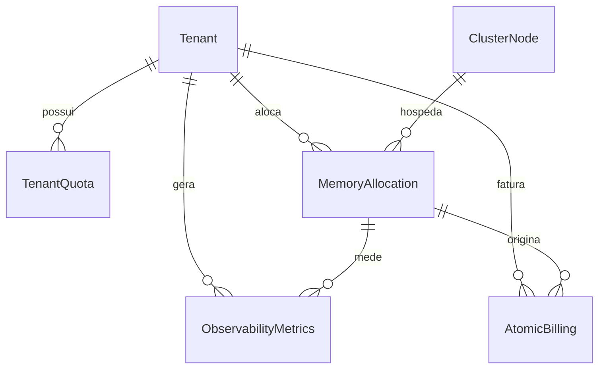

# Banco de Dados

O MaaS usa **PostgreSQL 15**. O schema ([`db/schema.sql`](https://github.com/)) é aplicado automaticamente na inicialização do container e exige a extensão `uuid-ossp`.

## Modelo relacional

## Tabelas

### `Tenant`
Clientes do PaaS.

| Coluna | Tipo | Notas |
| :--- | :--- | :--- |
| `tenant_id` | `UUID` PK | `uuid_generate_v4()` |
| `name` | `TEXT` | |
| `plan` | `TEXT` | ex.: `Developer` |
| `status` | `tenant_status` | `active` / `suspended` / `closed` |
| `api_key` | `TEXT UNIQUE` | `maas_live_...` |
| `created_at` | `TIMESTAMPTZ` | |

### `MemoryAllocation` — o coração do sistema
Cada registro corresponde a um `mmap` ativo ou histórico.

| Coluna | Tipo | Notas |
| :--- | :--- | :--- |
| `allocation_id` | `UUID` PK | |
| `tenant_id` | `UUID` FK → Tenant | |
| `node_id` | `UUID` FK → ClusterNode | |
| `shm_key` | `TEXT` | chave SHM do Linux |
| `mmap_offset_bytes` | `BIGINT` | ≥ 0 |
| `size_bytes` | `BIGINT` | > 0 |
| `isolation_cgroup_path` | `TEXT` | reservado (cgroups) |
| `state` | `allocation_state` | `provisioning` / `active` / `releasing` / `released` / `failed` |
| `created_at` / `released_at` | `TIMESTAMPTZ` | |

Índice parcial: `idx_alloc_tenant_active ON (tenant_id) WHERE state='active'`.

### `ClusterNode`
Nós físicos que provêem RAM (capacidade, região, heartbeat). No MVP há um nó semeado: `maas-core-dev` (`00000000-...-0001`).

### `TenantQuota`
Limites por tenant e período: `ram_bytes_limit`, `max_allocations`, `max_nodes`, com janela `effective_from`/`effective_to`.

### `ObservabilityMetrics`
Telemetria gravada via `ReportMetrics`: `rtt_ms`, `cache_hit_ratio`, `memory_pressure`, `net_bottleneck_score`, `stress_score`. Índice `idx_metrics_tenant_ts (tenant_id, ts DESC)`.

### `AtomicBilling`
Faturamento granular por consumo: `ts_start`/`ts_end`, `bytes_per_second`, `billed_bytes`, `unit_price_micros`, `amount_micros` (micro-precificação evita floats) e `integrity_hash` para auditoria.

## Enums de domínio

| Enum | Valores |
| :--- | :--- |
| `tenant_status` | `active`, `suspended`, `closed` |
| `node_status` | `healthy`, `degraded`, `offline`, `maintenance` |
| `allocation_state` | `provisioning`, `active`, `releasing`, `released`, `failed` |

## Acesso pelo Dashboard (Prisma)

O Dashboard usa **Prisma 7** com o adapter `@prisma/adapter-pg`. O schema Prisma (`dashboard/prisma/schema.prisma`) espelha as tabelas acima (nomes em minúsculas), e o client é gerado em `src/generated/prisma`. O Core, por sua vez, acessa o **mesmo** banco via libpq.

!!! tip "Relatório de consumo"
    O endpoint `GET /api/report` agrega `MemoryAllocation` por período usando `groupBy` (por tenant) e `date_trunc('month', created_at)` (evolução mensal). Veja [Dashboard](dashboard.md).
