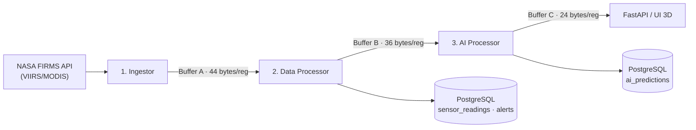

# Pipeline de Dados

O Sentinela processa dados térmicos em **três estágios**, conectados por **buffers de memória compartilhada** com layout binário fixo. Cada estágio é um processo independente que lê de um buffer e escreve no próximo.

Os três buffers são alocados no MaaS Core via gRPC `Allocate`; a `shm_key` retornada é mapeada localmente (`posix_ipc` + `mmap`) e a escrita é **circular** (`offset = (offset + record_size) % buffer_size`).

## Layout binário dos registros

Os formatos `struct` são validados por testes de *roundtrip* (`testes_consumidor/test_struct_formats.py`):

| Buffer | Conteúdo | `struct` | Tamanho |
| :--- | :--- | :--- | :--- |
| **A** | Dados brutos | `=ddddiii` (lat, lon, temp, frp, conf, type, id) | **44 bytes** |
| **B** | *Features* p/ ML | `=iffffffff` (reading_id + 8 floats) | **36 bytes** |
| **C** | Predições | `=iiffff` (counter, class, prob, urgency, lat, lng) | **24 bytes** |

## Estágio 1 — Ingestor (`ingestor.py`)

- **Handshake MaaS:** registra o tenant, libera alocações antigas (`Deallocate`) e aloca o Buffer A (`Allocate`); persiste metadados em `/dev/shm/maas_shm_info.txt`.
- **Coleta NASA FIRMS:** busca multi-sensor (VIIRS SNPP, VIIRS NOAA-20, MODIS) cobrindo o globo em *bounding boxes*. Há **fallback sintético** (regiões de calor/frio) quando não há dados reais.
- **Classificação inicial:** `type = 0` (calor, `temp ≥ 295K`) ou `1` (frio).
- **Escrita:** `struct.pack('=ddddiii', ...)` no Buffer A, em loop (~10s).

## Estágio 2 — Data Processor (`data_processor.py`)

- Lê o Buffer A em lotes; deduplica via LRU em memória.
- **Filtros analíticos (Data Mining):**
    - `is_fire = (type == 0)`
    - `is_anomaly = conf ≥ 80% AND temp ≥ 330K AND is_fire` → **CRITICAL**
    - caso contrário → `INFO` / `LOW`
- **Feature engineering:** densidade de vizinhos (raio ~50 km), hora e mês.
- **Persistência:** `INSERT` em `sensor_readings` + `alerts_history` (dedup por coordenadas/temperatura arredondadas).
- **Saída:** *feature vectors* (`=iffffffff`) no Buffer B.

## Estágio 3 — AI Processor (`ai_processor.py`)

- Carrega o modelo **LightGBM** (`models/sentinela_v1.txt`).
- **Inferência:** `model.predict(features)`; se o modelo não estiver disponível, usa um **fallback heurístico** com *gate* de temperatura (`temp < 310K → prob ≈ 0.05`) e *score* combinando temperatura, confiança, FRP e contexto temporal.
- **Urgência:** `urgency = 0.5·prob + 0.3·FRP_norm + 0.2·temp_norm`.
- **Saída:** predições (`=iiffff`) no Buffer C + `INSERT` em `ai_predictions`.

## Treinamento do modelo (`train_model.py`)

Offline, sob demanda: extrai dados de `sensor_readings`/`alerts_history` (label `1=CRITICAL`), faz split estratificado 80/20 e treina um classificador **LightGBM binário** (`num_leaves=31`, `max_depth=6`, `learning_rate=0.1`, 200 rounds), reportando *classification report*, ROC-AUC e *feature importance*. Salva em `models/sentinela_v1.txt`.

## Testes

`pytest` em `testes_consumidor/` cobre: formatos binários, ingestor (campos, fallback, classificação), endpoints da API, heurística de IA, urgência, vizinhança, classificação e o **pipeline integrado** ponta a ponta.
