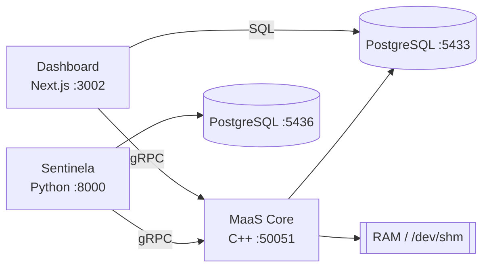

# MaaS — Memory as a Service

**MaaS (Memory as a Service)** é uma infraestrutura de **Software-Defined Memory** construída como plataforma de serviços (PaaS). Um núcleo em **C++** expõe pools de RAM física via **gRPC**, permitindo que clientes remotos aloquem, leiam e escrevam memória compartilhada pela rede — o conceito de **Memory Disaggregation**.

!!! info "Contexto Acadêmico"
    Projeto da disciplina **Projeto Integrador Computação III** (5º Período) — **TADS / FAESA Centro Universitário**.
    **Orientador:** Prof. Me. Howard Cruz Roatti · **Desenvolvimento:** Dyone Nunes de Andrade.

## O que esta documentação cobre

| Seção | Conteúdo |
| :--- | :--- |
| [Arquitetura](arquitetura.md) | Visão geral, planos (Data/Control) e fluxos |
| [Instalação e Execução](instalacao.md) | Como subir tudo com Docker Compose |
| [MaaS Core (C++)](maas-core.md) | O motor de memória: `mmap`, shared memory, concorrência |
| [Contrato gRPC](api-grpc.md) | O serviço `MemoryService` e suas mensagens |
| [Banco de Dados](banco-de-dados.md) | Modelo relacional (tenants, alocações, métricas, billing) |
| [Dashboard](dashboard.md) | O painel PaaS Next.js (tenants, alocação, relatórios) |
| [Sentinela Ambiental](consumidor/index.md) | O cliente de demonstração que consome o MaaS |
| [Guias](guias/manual-usuario.md) | Manuais do usuário e do desenvolvedor |

## Componentes em um relance



| Componente | Stack | Porta |
| :--- | :--- | :--- |
| MaaS Core | C++20 · gRPC · libpq | `50051` |
| Dashboard | Next.js 14 · Prisma 7 | `3002` |
| Banco do MaaS | PostgreSQL 15 | `5433` |
| Sentinela Ambiental | Python 3.11 · FastAPI | `8000` |

## Início rápido

```bash
docker compose up -d --build
# Dashboard:  http://localhost:3002
# MaaS Core:  localhost:50051 (gRPC)
```

Continue em [Instalação e Execução](instalacao.md).
